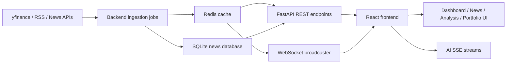

# Indian Stock Market Analytics

This project is a real-time Indian stock market analytics platform with market data, news aggregation, technical analysis, portfolio tracking, and AI-powered explainability.

It is split into two cooperating applications:

1. A FastAPI backend that collects data, stores news in SQLite, caches live quotes in Redis, exposes REST endpoints, streams AI responses, and broadcasts prices over WebSocket.
2. A React + Vite frontend that consumes those APIs, maintains UI state, and renders the dashboards, news panels, analysis views, and portfolio tools.

## What The App Does

The application is designed around a single workflow: ingest market data and news continuously, cache the latest values, and expose them to the UI in a form that is easy to explore.

The major user-facing features are:

- Live indices and market movers for NIFTY 50, SENSEX, BANK NIFTY, and NIFTY IT.
- Search for symbols, open detailed stock views, and inspect charts and fundamentals.
- News feeds with category and sector filtering plus sentiment labels.
- An AI explainer that turns price moves into a narrated summary with cited sources.
- A news impact analyzer that estimates which sectors or stocks may be affected by a headline.
- A sector heatmap and technical analysis views.
- A local portfolio tracker that calculates live profit and loss from cached quotes.
- A WebSocket live feed that keeps the dashboard updated without waiting for the next HTTP poll.

## System Flow



The important idea is that the backend does not wait for the frontend to request data before gathering it. It warms the cache in the background, and the frontend mostly reads from that cache through APIs and WebSocket updates.

## Backend Flow

The backend entry point is [backend/main.py](backend/main.py). On startup it performs the following steps:

1. Initializes the SQLite schema through `init_db()`.
2. Starts background polling for quotes and news.
3. Starts the APScheduler job runner.
4. Starts a broadcaster loop that watches the cache and pushes live updates to connected WebSocket clients.

### Startup And Background Jobs

The scheduler is defined in [backend/scheduler.py](backend/scheduler.py). It runs these jobs:

- `poll_quotes` every 60 seconds.
- `fetch_news` every 300 seconds.
- `persist_daily_ohlcv` once per day at 16:00 Asia/Kolkata.

That means the backend has two kinds of data flow:

- Push-style ingestion, where jobs fetch external data and store it in Redis or SQLite.
- Pull-style serving, where API routes read the latest cached or stored data when the frontend requests it.

### Market Data Flow

The market routes live in [backend/routers/market.py](backend/routers/market.py).

The main path is:

1. Poller fetches quotes and caches them under keys such as `indices`, `quote:<symbol>`, `gainers:NSE`, and `losers:NSE`.
2. `/api/indices`, `/api/gainers`, `/api/losers`, `/api/status`, `/api/sectors`, and `/api/symbols` serve that cached data.
3. If a quote or chart is not cached, the route falls back to live `yfinance` requests.
4. Technical endpoints such as `/api/chart`, `/api/fundamentals/{symbol}`, `/api/peers/{symbol}`, and `/api/indicators/{symbol}` fetch or derive deeper analysis on demand.

### News Flow

The news routes live in [backend/routers/news.py](backend/routers/news.py).

The flow is:

1. News ingestion jobs collect articles from RSS feeds and external news providers.
2. Articles are stored in SQLite as `NewsArticleDB` records.
3. The frontend calls `/api/news/latest`, `/api/news`, `/api/news/categories/count`, and `/api/sentiment` to browse that stored news.
4. Filters such as `ticker`, `category`, and `sector` are applied at query time.

### AI Flow

The AI routes live in [backend/routers/llm.py](backend/routers/llm.py).

There are two streaming endpoints:

- `POST /api/explain`
- `POST /api/impact`

Both return server-sent events rather than a single JSON response.

The flow for `/api/explain` is:

1. Read the cached quote for the requested symbol.
2. Optionally collect recent related news.
3. Build a prompt with the quote and source context.
4. Stream model tokens back to the client as SSE `token` events.
5. Finish with a `done` event containing the final narrative and confidence level.

The impact endpoint follows the same pattern but analyzes a headline instead of a price move.

### Portfolio Flow

The portfolio endpoint lives in [backend/routers/portfolio.py](backend/routers/portfolio.py).

The frontend sends a list of holdings to `POST /api/portfolio/value`. The backend looks up each symbol in the quote cache and returns:

- current price
- current value
- invested amount
- P&L
- P&L percentage

If a quote is missing, the response marks that holding as stale and leaves the live fields empty.

### Health And WebSocket Flow

`GET /api/health/detailed` checks the database, Redis, market status, current IST time, and last poll time.

`WS /ws/prices` does two things:

1. Sends an initial snapshot immediately when a client connects.
2. Broadcasts fresh indices, gainers, and losers whenever the cached quote timestamp changes.

That is how the dashboard updates without needing a full page refresh.

## Frontend Flow

The frontend entry point is [frontend/src/main.jsx](frontend/src/main.jsx), which mounts the React app inside a React Query provider.

The main app shell is [frontend/src/App.jsx](frontend/src/App.jsx).

### Data Fetching

The frontend uses React Query hooks defined in:

- [frontend/src/api/market.js](frontend/src/api/market.js)
- [frontend/src/api/news.js](frontend/src/api/news.js)
- [frontend/src/api/llm.js](frontend/src/api/llm.js)

These hooks handle polling, caching, and API URL prefixing.

The frontend also opens a WebSocket connection to `/ws/prices` and writes the live payload into Zustand store state. When that live payload exists, the UI uses it instead of waiting for the next HTTP poll.

### Main UI Regions

The app state lives in [frontend/src/store/useStore.js](frontend/src/store/useStore.js).

The frontend is organized around these major experiences:

- Markets dashboard: indices, gainers, losers, search, and selected stock details.
- News view: categorized and sector-filtered stories with sentiment markers and AI impact actions.
- Sectors view: sector performance heatmap.
- Guide view: pattern and technical analysis guidance.
- Analysis mode: a dedicated full-screen terminal for deeper symbol analysis.
- Portfolio overlay: persisted holdings and live valuation.

### Frontend Interaction Flow

1. The app starts and immediately loads market status and key market lists.
2. The WebSocket connection begins and merges live snapshots into local state.
3. React Query hooks fetch or refresh market, news, and sector data.
4. User actions such as symbol search, tab switching, or opening a stock detail panel trigger more focused API calls.
5. AI actions send streamed requests to the backend and render token-by-token output in the UI.

## Integration Details

The frontend and backend integrate through three channels:

### 1. Standard REST APIs

Used for market data, news, charts, fundamentals, peers, sector summaries, search, portfolio valuation, and health checks.

### 2. Server-Sent Events

Used for AI responses where the UI wants to display the answer as it is generated.

### 3. WebSocket Broadcasts

Used for the real-time market ticker and dashboard snapshots.

The connection between them is simple:

- ingestion jobs update Redis and SQLite
- API routes read from Redis and SQLite
- the frontend reads those APIs through React Query
- the WebSocket stream keeps the most visible widgets fresh

## Project Structure

```text
market-app/
  backend/            FastAPI app, schedulers, ingestion, AI routes, database, cache
  frontend/           React app, UI components, React Query hooks, Zustand store
  docker-compose.yml  Redis + backend local orchestration
  requirements.txt    Shared Python dependencies
  .env.example        Environment variable template
```

## Setup Requirements

### Prerequisites

- Python 3.11 or newer
- Node.js 18 or newer
- npm
- Redis, either locally or through Docker
- Ollama if you want local AI generation, or the configured remote Ollama-compatible endpoint

### Environment Variables

The project reads configuration from `.env`. The most important settings are:

- `REDIS_URL`: Redis connection string
- `DB_URL`: SQLite database path or other SQLAlchemy-compatible URL
- `OLLAMA_URL`: Ollama API base URL
- `OLLAMA_MODEL`: primary model name
- `OLLAMA_FALLBACK` and `OLLAMA_FALLBACK_2`: optional fallback models
- `NEWSDATA_API_KEY`: NewsData API key
- `GNEWS_API_KEY`: GNews API key
- `CORS_ORIGINS`: allowed frontend origins

Refer to [.env.example](.env.example) for the full template.

## Local Setup On Windows

The backend should be started from the backend directory. This matters because imports and the default working directory are expected there.

### 1. Start Redis

```powershell
docker run -d -p 6379:6379 redis:7-alpine
```

If you prefer Docker Compose, the supplied [docker-compose.yml](docker-compose.yml) also starts Redis and the backend together.

### 2. Set Up The Backend

```powershell
cd D:\Market_App\Market_App\market-app\backend
python -m venv venv
.\venv\Scripts\activate
pip install -r ..\requirements.txt
python -m spacy download en_core_web_sm
uvicorn main:app --reload --port 8000
```

### 3. Set Up The Frontend

```powershell
cd D:\Market_App\Market_App\market-app\frontend
npm install
npm run dev
```

The frontend will usually be available at `http://localhost:5173`.

### 4. Verify The Services

```powershell
curl http://localhost:8000/api/health/detailed
curl http://localhost:8000/api/indices
curl http://localhost:8000/api/news/latest
```

## Docker Setup

To run the backend and Redis together:

```powershell
cd D:\Market_App\Market_App\market-app
docker-compose up -d redis
```

The backend service in the compose file expects the FastAPI app to be available through the backend container build and `uvicorn main:app --host 0.0.0.0 --port 8000 --reload`.

## LLM Setup

The backend is written to work with an Ollama-compatible API.

Typical local setup:

```powershell
winget install Ollama.Ollama
ollama pull mistral:7b-instruct
```

Then update `.env` so `OLLAMA_URL` points to your local Ollama server and `OLLAMA_MODEL` matches the model you actually pulled.

If you are using a remote or hosted Ollama-compatible endpoint, keep the URL and model values aligned with that provider.

## API Reference

| Method | Endpoint                         | Purpose                                  |
| ------ | -------------------------------- | ---------------------------------------- |
| GET    | `/api/health`                    | Basic liveness check                     |
| GET    | `/api/health/detailed`           | Database, Redis, and market status check |
| GET    | `/api/status`                    | Market open/closed/holiday status        |
| GET    | `/api/indices`                   | Current major indices                    |
| GET    | `/api/gainers?exchange=NSE&n=10` | Top gainers                              |
| GET    | `/api/losers?exchange=NSE&n=10`  | Top losers                               |
| GET    | `/api/quote?symbol=...`          | Single quote lookup                      |
| GET    | `/api/chart?symbol=...&range=1D` | OHLCV chart series                       |
| GET    | `/api/search?q=...`              | Symbol search                            |
| GET    | `/api/symbols`                   | NIFTY 50 symbol list                     |
| GET    | `/api/sectors`                   | Sector heatmap data                      |
| GET    | `/api/fundamentals/{symbol}`     | Fundamental metrics                      |
| GET    | `/api/peers/{symbol}`            | Sector peers                             |
| GET    | `/api/indicators/{symbol}`       | Technical indicators                     |
| GET    | `/api/news/latest`               | Latest news articles                     |
| GET    | `/api/news?ticker=...`           | Filtered news                            |
| GET    | `/api/news/categories/count`     | Category counts                          |
| GET    | `/api/sentiment`                 | Sentiment summary                        |
| POST   | `/api/explain`                   | Streamed AI price explanation            |
| POST   | `/api/impact`                    | Streamed AI impact analysis              |
| POST   | `/api/portfolio/value`           | Live portfolio valuation                 |
| WS     | `/ws/prices`                     | Live indices and movers stream           |

## Operational Notes

- The backend uses Redis when available, but it has an in-process fallback cache so the app can still run when Redis is temporarily unreachable.
- News data is persisted in SQLite, which keeps the historical feed available across restarts.
- The frontend relies on polling plus WebSocket updates, so it remains responsive even when the market is closed.
- The AI endpoints stream output and should be consumed as SSE rather than standard JSON.

## Limits And Disclaimers

- Yahoo Finance data is subject to Yahoo Finance terms and is intended for personal or non-commercial use.
- AI-generated summaries are not financial advice.
- External APIs may have rate limits, so cached and persisted data are used to reduce repeated calls.

## Useful Files

- Backend app entry: [backend/main.py](backend/main.py)
- Scheduler: [backend/scheduler.py](backend/scheduler.py)
- Market routes: [backend/routers/market.py](backend/routers/market.py)
- News routes: [backend/routers/news.py](backend/routers/news.py)
- LLM routes: [backend/routers/llm.py](backend/routers/llm.py)
- Portfolio routes: [backend/routers/portfolio.py](backend/routers/portfolio.py)
- Frontend app shell: [frontend/src/App.jsx](frontend/src/App.jsx)
- Frontend API hooks: [frontend/src/api/market.js](frontend/src/api/market.js), [frontend/src/api/news.js](frontend/src/api/news.js), [frontend/src/api/llm.js](frontend/src/api/llm.js)
